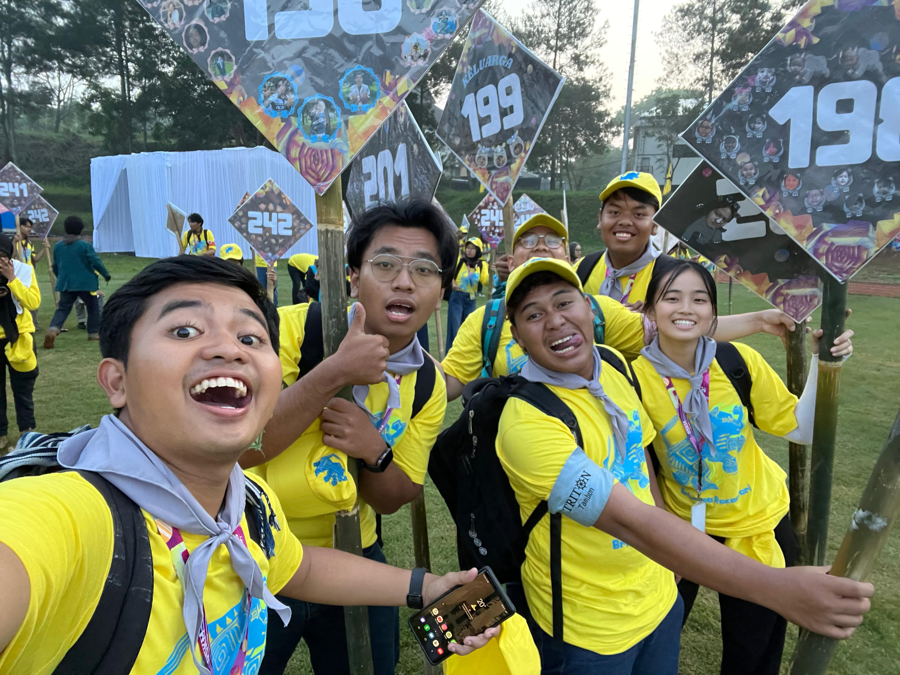

# UAS-2 My Opinions

Apa itu beropini? Opini adalah "rebusan" dari informasi, nilai, dan perasaan. Berikut adalah pandangan saya tentang urgensi revolusi pendidikan global.

**Transformasi Pendidikan Global: Dari Menstandarisasi Manusia ke Memanusiakan Standar**

{width=950%}

## I. Krisis Model Konvensional di Tengah Kesenjangan Global

Dunia pendidikan saat ini menghadapi **paradoks yang menyakitkan**. Di satu sisi, *Artificial Intelligence* (AI) telah berkembang menjadi **"Juru Tulis Cerdas"** yang mampu menulis esai dan kode program dalam hitungan detik. Namun di sisi lain, data menunjukkan **750 juta orang dewasa** di dunia masih buta huruf dan tidak mampu membaca satu kalimat sederhana pun.

Model pendidikan konvensional—yang mengandalkan **infrastruktur fisik** (gedung sekolah), **kurikulum kaku** (satu ukuran untuk semua), dan **kehadiran sinkron**—**tidak lagi memadai** untuk mengejar ketertinggalan ini. Model ini gagal karena berasumsi bahwa semua siswa memiliki kecepatan belajar dan akses sumber daya yang sama.

Opini saya didasarkan pada sudut pandang bahwa mempertahankan model "batu bata dan semen" untuk daerah 3T (Tertinggal, Terdepan, Terluar) adalah sebuah kesia-siaan. Kita sedang membiarkan jutaan otak manusia tidak terpakai (*underutilized*) hanya karena mereka tidak cocok dengan sistem pabrikasi pendidikan massal.

## II. Ruang Belajar sebagai Hak Asasi Digital

Pergeseran paradigma diperlukan: mengubah pandangan dari "Siswa harus pergi ke sekolah" menjadi **"Sekolah harus mendatangi siswa"**.

Dalam visi ini, ruang kelas bukan lagi empat tembok fisik, melainkan **ruang kognitif** yang difasilitasi teknologi. Setiap anak, baik di desa terpencil maupun di kamp pengungsi, harus dipandang sebagai **"Protagonis-Penulis"** yang memiliki otoritas atas masa depan mereka sendiri.

Tugas kita sebagai rekayasawan sistem bukan sekadar memberi mereka buku, tetapi memberi mereka **agensi**. Kita harus merancang sistem di mana mereka bisa menukar **energon** (waktu dan usaha belajar) mereka menjadi *skill* yang relevan, tanpa terhalang oleh ketiadaan guru fisik atau biaya transportasi.

## III. The Adaptive Learning Engine: Solusi Ko-Kreasi Nilai

Untuk menjawab tantangan ini, saya mengusulkan **The Adaptive Learning Engine** sebagai manifestasi dari **Penciptaan Nilai Bersama** (*Value Co-creation*).

Filosofi utamanya adalah **membawa personalisasi privat ke ruang publik**. Solusi ini mengubah cara kita memandang pendidikan:

### 1. Dari Hafalan ke Pemahaman Adaptif
Sistem tidak lagi menuntut siswa menghafal fakta (yang sudah bisa dilakukan AI), tetapi melatih **pola berpikir**. Dengan bantuan AI, materi pelajaran menyesuaikan diri (*adapt*) dengan gaya belajar siswa. Jika siswa gagal paham lewat teks, sistem menyajikan visual. Ini adalah bentuk "memanusiakan standar"—bukan siswa yang dipaksa tunduk pada kurikulum, tapi kurikulum yang melayani siswa.

### 2. Gamifikasi sebagai Mata Uang Motivasi
Mengadopsi konsep *Knowledge Marketplace*, progres belajar dalam sistem ini dirancang memberikan **"rasa menciptakan nilai"**. Setiap modul yang diselesaikan bukan hanya memberi nilai angka, tapi membuka akses ke fitur atau konten baru (gamifikasi). Ini penting untuk menjaga motivasi belajar mandiri tanpa pengawasan guru fisik.

### 3. Portofolio Literasi Nyata
Hasil akhirnya bukan sekadar ijazah, melainkan **jejak data kompetensi**. Sistem ini mencatat "perjuangan" siswa—di mana mereka gagal, bagaimana mereka bangkit, dan apa yang mereka kuasai. Ini sejalan dengan pembentukan karakter *resiliensi*, memastikan bahwa mereka benar-benar siap menjadi manusia berdaya, bukan sekadar lulusan yang pandai menjawab ujian.

---
**Kesimpulan Opini:**
Teknologi AI tidak boleh hanya menjadi mainan orang kaya. Ia harus menjadi **equalizer** (penyeimbang) yang mendobrak tembok penghalang literasi. Inilah saatnya kita menggunakan kecerdasan buatan untuk menyelamatkan kecerdasan alami manusia.