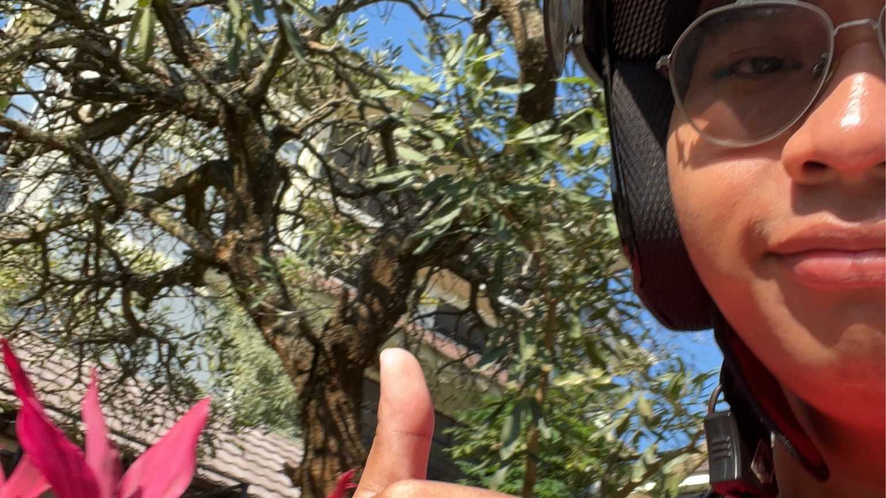

# Selamat Datang {.unnumbered}

## My Masterpiece
Menghadapi era *Artificial Intelligence*, mahasiswa STI mendapat kesempatan besar untuk membangun sistem yang tidak hanya canggih secara teknis, tetapi juga memanusiakan. Salah satu [masalah terbesar global](./images/top10.pdf) yang mendesak untuk diselesaikan adalah **Akses Pendidikan dan Melek Huruf**.

:::{#fig-Concept}

Visualisasi Semangat The Adaptive Learning Engine.
:::

## About Me

{width=450}

**Riantama Putra** adalah mahasiswa Program Studi Sistem dan Teknologi Informasi, Institut Teknologi Bandung, Angkatan 2024.

Lahir dan tumbuh dengan ketertarikan pada logika komputer, Rian kini sedang mendalami bagaimana teknologi perangkat lunak dapat menjadi jembatan bagi masalah sosial. Di luar kesibukan akademik dan tugas besar (Tubendum) yang tiada henti, ia menyeimbangkan hidup dengan bermain *game* RPG, mendengarkan musik, dan bereksperimen dengan desain visual.

Jejak digital dan repositori kode dapat dilihat di GitHub <https://github.com/veinsan>.

***

Ada satu momen menarik saat saya mengerjakan tugas "My Masterpiece" ini di sela-sela persiapan UAS lainnya. Seorang teman satu jurusan sempat bertanya saat melihat layar laptop saya penuh dengan data statistik buta huruf, bukan baris kode seperti biasanya.

"Yan, ngapain repot-repot riset data sosial gini? Kita kan anak teknik, yang penting algoritmanya jalan, 'kan?"

Saya sempat terdiam sejenak. Dulu, mungkin saya akan setuju. Bagi kami mahasiswa teknik, *code that runs* seringkali dianggap segalanya. Tapi mata kuliah Komunikasi Interpersonal dan Publik ini perlahan mengubah perspektif saya.

"Justru itu," jawab saya akhirnya. "Kalau kita membuat algoritma untuk masalah yang tidak benar-benar kita pahami manusianya, kita cuma menciptakan sampah digital baru. Menulis kode itu logis, tapi memahami siapa yang akan memakai kode itu butuh hati."

Teman saya tertawa kecil, "Wah, tumben bijak. Kebanyakan ngerjain tugas refleksi ya?"

Haha, saya hanya tersenyum. Bagi saya, celetukan itu adalah validasi kecil. Itu tandanya saya sedang belajar melangkah lebih jauh: bukan sekadar menjadi *tukang coding*, tetapi menjadi seorang *problem solver* yang peduli.

Selamat menikmati portofolio sederhana ini.