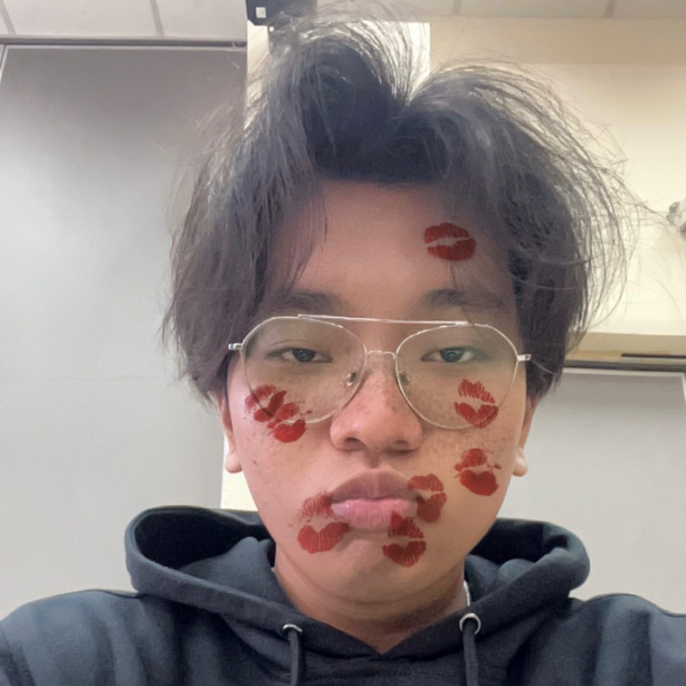

# UAS - My Masterpiece: Bridging the Gap

{width=950%}

Halo kembali! Saya **Riantama Putra**, mahasiswa Sistem dan Teknologi Informasi ITB.

Jika pada paruh pertama semester saya mengajak Anda menyelami siapa saya sebagai individu, kini saatnya saya melangkah lebih jauh. UAS ini bukan lagi tentang refleksi ke dalam (*inward looking*), melainkan tentang bagaimana saya memproyeksikan diri ke luar (*outward looking*) untuk memberi dampak nyata.

Di bawah tema besar **"Penerapan Sistem dan Teknologi Informasi di Era Artificial Intelligence"**, saya mempersembahkan *Masterpiece* saya: sebuah inisiatif untuk menjawab tantangan **Akses Pendidikan dan Literasi Global**.

## Mengapa Pendidikan? Sebuah Identitas Naratif

Dosen saya pernah berkata bahwa manusia adalah *storytelling organisms*. Kita hidup dari cerita yang kita rangkai. Namun, bagaimana seseorang bisa merangkai cerita hidupnya jika ia bahkan tidak bisa membaca kata-kata?

Data menunjukkan ada **750 juta orang dewasa** yang buta huruf dan **250 juta anak** yang tidak bersekolah. Bagi saya, ini adalah sebuah *tragedi naratif*. Mereka bukan tidak punya potensi, mereka hanya kehilangan alat untuk menuliskan kisah sukses mereka sendiri.

Sebagai mahasiswa STI, saya melihat ini bukan hanya sebagai masalah sosial, tapi sebagai *system error* yang masif. Saya merasa memiliki tanggung jawab - sebuah **Agensi** - untuk tidak hanya menjadi penonton, tetapi menjadi aktor yang menawarkan solusi.

## Masterpiece Saya: Teknologi yang Memanusiakan

Dalam portofolio UAS ini, saya mengembangkan konsep **"The Adaptive Learning Engine"**.

Ini adalah perpaduan antara logika teknis dan empati manusiawi - dua sisi yang selalu saya pegang teguh.
* **Secara Rasional:** Menggunakan AI untuk mendemokratisasi akses pendidikan berkualitas yang selama ini mahal.
* **Secara Emosional:** Memastikan teknologi tersebut tidak kaku, melainkan adaptif terhadap kebutuhan unik setiap pembelajar di daerah terpencil.

## Transformasi Diri: Dari "Merenung" ke "Bertindak"

Nilai-nilai saya - **kejujuran, empati, dan tanggung jawab** - kini menemukan ujian nyatanya.
* **Kejujuran:** Mengakui bahwa teknologi bukan solusi ajaib, tapi alat bantu yang butuh sentuhan manusia.
* **Empati:** Merancang sistem bukan berdasarkan apa yang "keren" menurut programmer, tapi apa yang "dibutuhkan" oleh pengguna yang bahkan belum pernah memegang smartphone.
* **Tanggung Jawab:** Memastikan solusi ini etis dan inklusif.

## Harapan Melalui Karya Ini

Halaman-halaman berikutnya (My Concepts, My Opinions, My Innovations, My Knowledge) adalah bukti komitmen saya. Ini adalah cara saya mengubah narasi pesimisme (keluarga miskin tidak bisa sekolah) menjadi narasi penebusan (*redemption story*), di mana teknologi hadir sebagai jembatan menuju masa depan yang lebih baik.

Selamat datang di *Masterpiece* saya. Mari kita tulis ulang cerita pendidikan dunia, satu baris kode pada satu waktu.

---

> *"Technology is best when it brings people together."* - Matt Mullenweg
>
> Dan bagi saya, teknologi terbaik adalah yang memberi suara bagi mereka yang selama ini tidak terdengar.